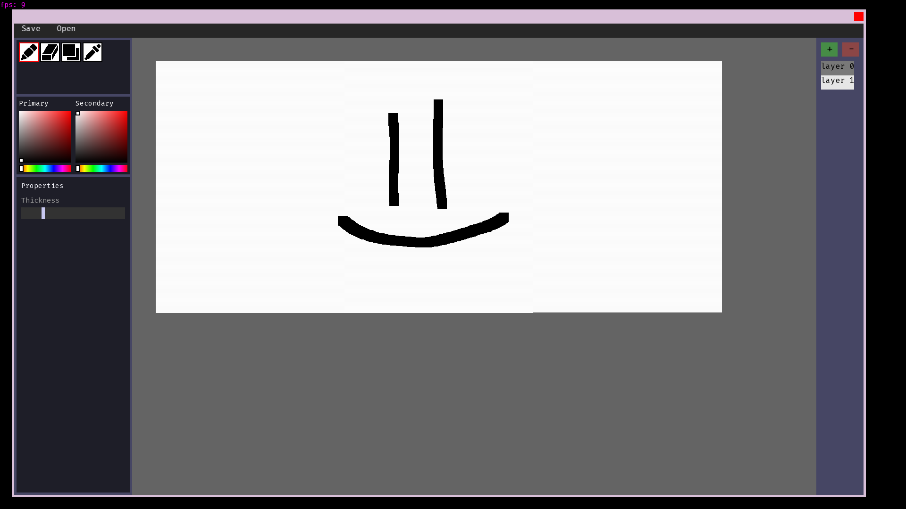

# YAGE - Yet Another Graphics Editor
> powered by [ShishGL](https://github.com/Shishqa/ShishGL)



## Features

* save and open files!
* choose colors!
* use [PLUGINS](https://github.com/fckxorg/editor_plugin_api)!

## Building

```bash
$ git submodules update --init --recursive
$ mkdir build
$ cd build
$ cmake ..
$ cmake --build .
```

### Running

```bash
$ cd <repo-root>
$ ./build/yage
```

## TBD

* alpha blending in ShishGL is extremely slow!
